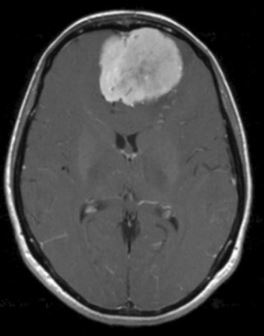

# Cancer Prediction

This repository contains a Jupyter Notebook implementing a cancer prediction model using machine learning and deep learning techniques. The code is designed to preprocess medical imaging data, train a convolutional neural network (CNN), and evaluate its performance on a given dataset.

---

## Features

- **Data Preprocessing**: Uses libraries like `pandas` and `numpy` for data manipulation and `ImageDataGenerator` for data augmentation.
- **Model Architecture**: Implements a CNN using TensorFlow/Keras for image-based cancer detection.
- **Performance Evaluation**: Includes metrics to evaluate the accuracy and effectiveness of the model.
- **User-Friendly Workflow**: The code is modular and easy to customize for different datasets or configurations.

---

## Requirements

To run this project, ensure you have the following dependencies installed:

- Python 3.7+
- TensorFlow 2.x
- Scikit-learn
- Pandas
- NumPy
- Matplotlib

Install the dependencies using:
```bash
pip install -r requirements.txt
```

---

## Dataset

The code assumes the presence of a dataset of medical images organized into labeled directories. Update the `data_dir` variable in the notebook with the path to your dataset.

### Directory Structure

```plaintext
/data_dir/
    /class_1/
        image_1.jpg
        image_2.jpg
        ...
    /class_2/
        image_3.jpg
        image_4.jpg
        ...
```

### Sample Images
Below are some sample images from the dataset:

#### Class 1 (Cancerous Tumor)

![Sample Image 2]images/Y163.JPG)

#### Class 2 (Non-Cancerous Tumor)


---

## How to Run

1. Clone this repository:
   ```bash
   git clone https://github.com/yourusername/cancer-prediction.git
   cd cancer-prediction
   ```

2. Install the required libraries:
   ```bash
   pip install -r requirements.txt
   ```

3. Open the Jupyter Notebook:
   ```bash
   jupyter notebook Cancer_Detection.ipynb
   ```

4. Update the `data_dir` variable in the notebook with the path to your dataset.

5. Run the cells in sequence to train and evaluate the cancer prediction model.

---

## Model Architecture

The model uses a convolutional neural network (CNN) with the following layers:

- **Convolutional Layers**: Extract features from input images.
- **Pooling Layers**: Downsample feature maps to reduce computational complexity.
- **Fully Connected Layers**: Learn complex patterns and relationships.
- **Dropout**: Prevent overfitting by randomly dropping connections.

---

## Results

The notebook provides detailed output on the model's performance, including:

- Training and validation accuracy/loss.
- Confusion matrix and classification report.
- Visualization of correctly and incorrectly classified samples.

---

## Contributing

Contributions are welcome! To contribute:

1. Fork this repository.
2. Create a new branch:
   ```bash
   git checkout -b feature-name
   ```
3. Make your changes and commit them:
   ```bash
   git commit -m 'Add feature-name'
   ```
4. Push to the branch:
   ```bash
   git push origin feature-name
   ```
5. Open a pull request.

---

## License

This project is licensed under the MIT License. See the `LICENSE` file for details.

---

## Acknowledgments

- The TensorFlow and Keras teams for their powerful libraries.
- Contributors to open-source tools like NumPy, Pandas, and Scikit-learn.
- Researchers and medical professionals for advancing cancer detection and treatment.
